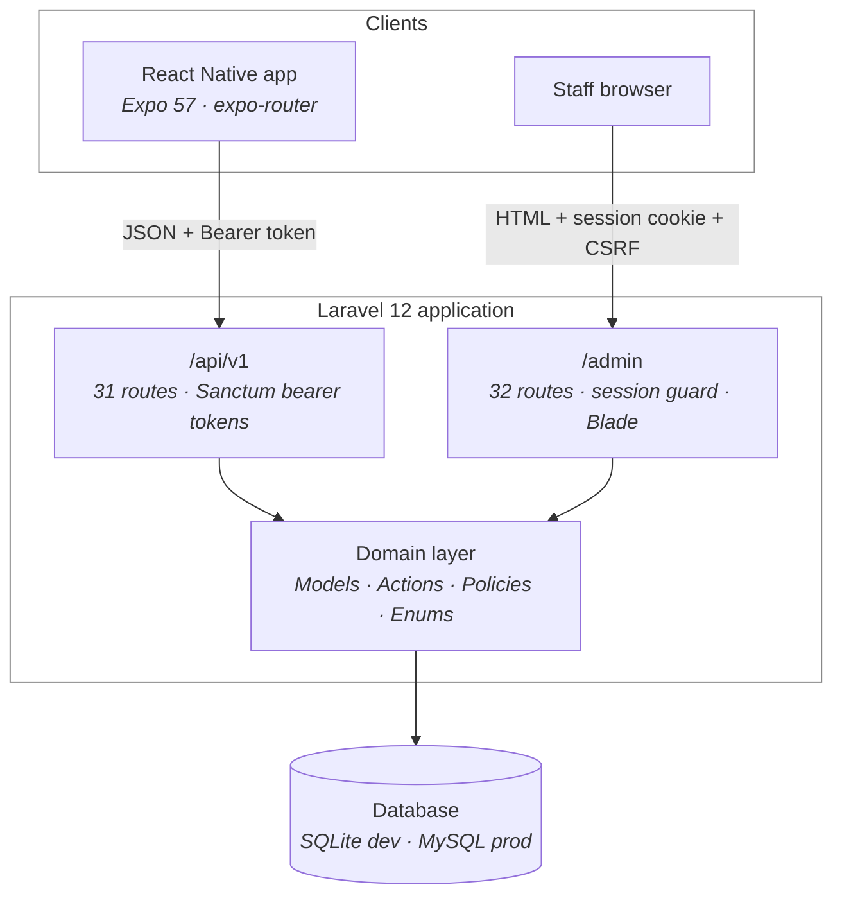
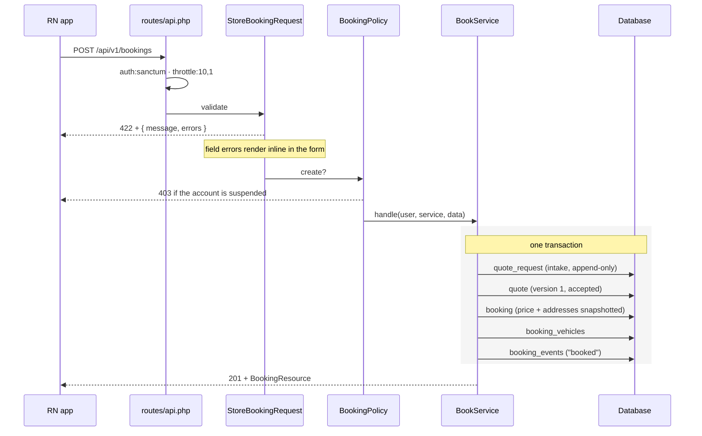
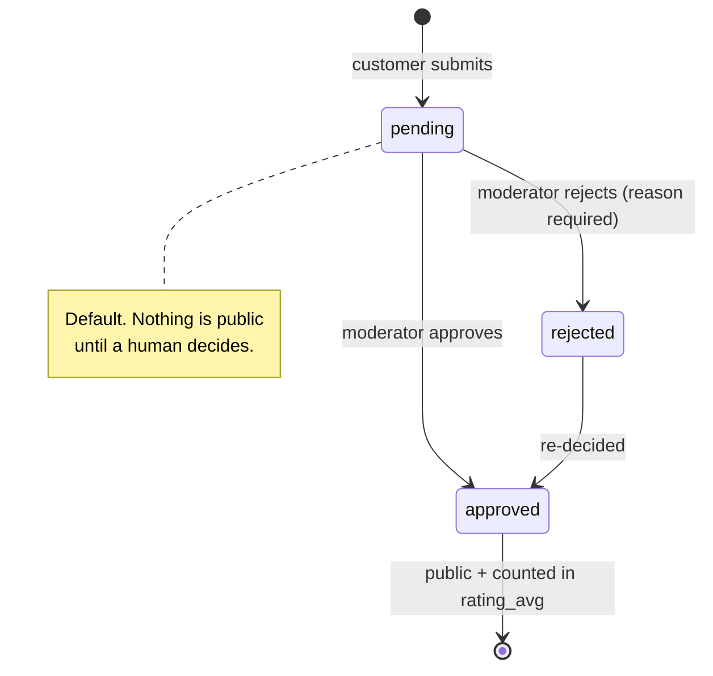

# AutoTransport — System Architecture

**Companion documents:** [`database-design.md`](database-design.md) (schema and its rationale) ·
[`backend.md`](backend.md) (Laravel API + admin panel) · [`mobile.md`](mobile.md) (React Native client) ·
[`product-spec.md`](product-spec.md) (wireframes, feature list, traceability)

This document covers what the pieces are, how a request moves through them, and
the handful of invariants that hold the system together. Where it says "why",
that reasoning is the point — the *what* is recoverable from the code, the *why*
is not.

---

## 1. The system in one paragraph

Three deployables share one database. A **Laravel 12 API** serves a JSON contract
under `/api/v1` to a **React Native (Expo 57) client**, and the same Laravel app
serves a **server-rendered admin panel** at `/admin` for staff. Customers browse
services, book a shipment, track it, and review it once delivered. Staff price
leads, move shipments through a state machine, moderate reviews, and manage users
and roles. There is no separate admin SPA, no BFF layer and no message broker —
the whole thing is two HTTP surfaces over one MySQL/SQLite schema.

---

## 2. Component map



**Why one Laravel app rather than an API plus a separate admin SPA.** The admin
panel is CRUD over the same models the API already exposes, used by a handful of
staff on desktop browsers. A second frontend would mean a second build pipeline,
a second auth mechanism, a second deployment, and a second place for the domain
rules to drift out of sync — in exchange for interactions this panel does not
need. Blade renders the panel from the same models the API serialises, so a
change to `BookingStatus::allowedNext()` reaches both surfaces at once.

**The cost, stated plainly:** the panel is a full page load per interaction, and
anything genuinely interactive (a drag-and-drop dispatch board, live tracking)
would fight the architecture rather than fit it. That is the trade, and it is the
right one until dispatch volume makes it wrong.

---

## 3. Two authentication surfaces, deliberately different

| | Mobile client | Admin panel |
|---|---|---|
| Credential | Sanctum personal access token | Session cookie |
| Transport | `Authorization: Bearer …` | Cookie + CSRF token |
| Storage | Keychain / Keystore (`expo-secure-store`) | Browser cookie jar |
| Guard | `auth:sanctum` | `auth` + `staff` + `permission:*` |
| Failure mode | `401` JSON | `302` to `/admin/login` |

These are not two ways of doing the same thing. A token has no CSRF exposure
because it is never sent ambiently — the client attaches it deliberately. A
cookie is sent by the browser on every request to the origin, including ones
triggered by another site, which is exactly why the panel needs CSRF tokens and
the API does not.

**The rule that falls out of this:** never authenticate the API with the session
guard "for convenience" in a test or a webhook. It re-introduces CSRF exposure on
endpoints that have no CSRF protection.

---

## 4. The request lifecycle

### 4.1 A customer books a shipment



The four inserts are one transaction because a booking with no quote behind it
cannot answer *"what were they quoted, and when?"* — and that question arrives
from a chargeback, not from curiosity. `bookings.quote_id` is nullable, so
nothing at the database level would have caught a bare insert. See
[`backend.md` §4](backend.md#4-the-booking-chain) for the full reasoning.

### 4.2 A customer reviews a delivered shipment



Three constraints enforce review integrity in the schema rather than in a
controller: `booking_id` is `UNIQUE` (one review per shipment), `booking_id` is
`NOT NULL` (no review without a real transaction), and `status` defaults to
`pending` (fail closed). The application adds the two a foreign key cannot
express: the booking must be *delivered*, and it must belong to the reviewer.

---

## 5. The contract seam, and why it is the sharpest edge here

The API contract exists in two places that are not mechanically linked:

| Side | File | Holds |
|---|---|---|
| Server | `backend/routes/api.php` | the real route strings |
| Client | `mobile/src/api/endpoints.ts` | the strings the app calls |
| Server | `app/Http/Resources/*.php` | the real response shapes |
| Client | `mobile/src/types/api.ts` | the shapes the app expects |

**Renaming a route on one side without the other is a silent 404 at runtime, not
a compile error.** TypeScript happily type-checks a string that no longer routes
anywhere. There is no code generation between them.

This is a deliberate trade — hand-written types stay reviewable in a diff — but
it needs a discipline to survive:

```bash
cd backend && php artisan route:list --path=api
```

Diff that against `endpoints.ts` whenever either side changes.

**This is not hypothetical.** During construction, `StoreReviewRequest` required
an integer `booking_id` while `BookingResource` only ever emitted a ULID. Both
sides type-checked. Both sides had passing tests. The endpoint was simply
unreachable from the app that was written to call it, and nothing caught it until
someone tried to submit a review end to end. The fix — routing on ULID — is now
described in §6.

---

## 6. Identifiers: three kinds, on purpose

| Kind | Example | Who sees it | Why |
|---|---|---|---|
| `id` (BIGINT) | `1847` | Server only | InnoDB clusters on the PK; a 16-byte random key bloats every secondary index |
| `ulid` | `01KZT9QHBJ…` | API, app URLs | Unguessable, but still time-sortable so the index does not fragment |
| Human reference | `BK-2026-000318` | Customers, phone calls | Short enough to read aloud |

A sequential id in a payload leaks two things: **volume** (`/bookings/1847` tells
a competitor how many shipments you have done, and two probes a month apart give
them your growth rate) and **enumerability** (one missing authorization check
becomes a full-table read instead of one leaked record).

**ULIDs are defence in depth, never authorization.** Every owner-scoped endpoint
still runs a policy check, and scoped `exists` rules return *not found* rather
than *forbidden* so a probe cannot confirm that a row exists.

---

## 7. Invariants worth protecting

These hold across both surfaces. Breaking one is how this system fails quietly.

**Money is integer minor units, end to end.** Every amount is `*_cents` with a
sibling `currency`. Floats cannot represent `0.1`; summing a thousand deposits
accumulates drift that surfaces as a reconciliation mismatch nobody can explain.
Gateways already speak minor units, so this also removes a conversion at the
integration seam. The API emits `{ cents, currency }` and the client formats it
through `formatMoney()` — never a bare division in a template.

**Anything on a document a human might later rely on is snapshotted.** Booking
addresses are flat copies, not foreign keys. If a booking pointed at
`address_id = 42` and the customer moved house, every delivered shipment record
would silently rewrite itself to claim it went somewhere it never went.

**Status changes and timeline events are written together.** `Booking::transitionTo()`
validates against the state machine and writes both inside one transaction. A
timeline with a hole in it is worthless as an audit trail, and the hole would only
be noticed during the dispute it existed to settle.

**Rating aggregates are denormalised, with a rebuild path.** `services.rating_avg`
is maintained by an observer because computing `AVG()` on every services-page
render is a full scan of the reviews table on the highest-traffic page. The risk
is drift: if a listener fails, the cached number is wrong forever with no
self-correction. `php artisan reviews:rebuild-aggregates` recomputes from source.
*Denormalisation without a rebuild path is a bug waiting to be found by a
customer.*

**Model events are load-bearing.** `HasUlid` populates `ulid` on the `creating`
event and `ReviewObserver` maintains aggregates on save. Laravel's stock
`DatabaseSeeder` ships with `use WithoutModelEvents`, which silently disables
both — every seeded row then fails the `NOT NULL` constraint on `ulid`, and where
a column happens to be nullable it inserts blank instead, which is worse. That
trait is removed, and the reason is written into the file so it does not come
back.

---

## 8. What is deliberately not built

Stated so nobody assumes otherwise from a half-present seam:

- **Payment capture.** The `payments` ledger and its schema exist; no gateway is
  wired. Bookings open at `pending_payment` and stay there until staff move them.
- **Email delivery.** Saving a reply to a contact message writes the audit trail.
  It does not send anything. The admin form says so, because the alternative is a
  support agent believing a message went out.
- **Quote accept / decline endpoints.** `endpoints.ts` lists
  `/quotes/{ulid}/accept`; there is no controller. Accepting a staff-issued quote
  is a second path into `BookService` and has not been built — the in-app instant
  booking flow is the only route to a booking today.
- **Distance lookup.** `QuoteEstimator` uses a stubbed distance with a
  1000-mile fallback. Wiring a real distance matrix means caching by lane
  (`pickup_postal_code`, `dropoff_postal_code`) — the same lane is requested
  repeatedly and the API is billed per call.
- **Guest quote-request claiming.** `quote_requests.user_id` is nullable so guests
  can get a price. Claiming that history on registration must happen **only after
  `email_verified_at` is set** — otherwise anyone can type a stranger's address
  and inherit their addresses and VINs. This is the sharpest security edge in the
  schema and the verification gate is load-bearing.

---

## 9. Repository layout

```
AutoTransport/
├── .gitignore          master ignore file — see §10
├── .gitattributes      line-ending and diff rules for the whole tree
├── README.md           orientation and quick start
├── docs/
│   ├── architecture.md this file
│   ├── backend.md      Laravel API + admin panel
│   ├── mobile.md       React Native client
│   ├── database-design.md  schema rationale (read this first for data questions)
│   └── erd.mermaid
├── backend/            Laravel 12
└── mobile/             Expo 57  ← its own git repository, see §10
```

---

## 10. Version control layout

One master `.gitignore` at the root replaces the former `backend/.gitignore` and
covers both projects. Two things about it are easy to get wrong:

**Anchored patterns had to be re-anchored, not copied.** A leading slash anchors
a pattern to the directory containing the `.gitignore`. `/vendor` in
`backend/.gitignore` meant `backend/vendor`; moved to the root verbatim it means
`AutoTransport/vendor`, which does not exist — and Composer's vendor tree
silently becomes untracked-but-visible. Every anchored rule now names its
subdirectory.

**The `.gitignore` files under `backend/storage/` are not ignore rules.** Each
holds `*` plus `!.gitignore`, which is the standard way to commit an *empty*
directory: Git tracks files, not folders. They are the only reason
`storage/framework/views/` exists after a clone. Delete them and the app boots,
then dies on the first page render with *failed to open stream* — a failure that
appears only on a fresh checkout, never on the machine that caused it. Nine of
them remain, on purpose.

**Agent configuration is ignored, `AGENTS.md` is not.** `.claude/`, `CLAUDE.md`,
`CLAUDE.local.md` and `.mcp.json` are ignored at any depth:
`settings.local.json` accumulates a permission allowlist full of absolute paths
from the machine that produced it, and `.mcp.json` can carry server tokens.
`CLAUDE.md` here is a one-line `@AGENTS.md` pointer, so ignoring it costs
nothing — the instructions live in `AGENTS.md`, which stays committed and is the
vendor-neutral filename other agent tools read too. There is an explicit
`!AGENTS.md` so a future broader glob cannot swallow it.

**`mobile/` is still a separate git repository** with its own remote, so it keeps
its own `.gitignore`; a root-level file has no authority over a nested repo. The
agent rules above are therefore duplicated into `mobile/.gitignore` deliberately.
Consolidating fully means removing `mobile/.git`, which unlinks it from its
remote and discards its history — a decision for whoever owns that repo, not a
side effect of a documentation pass.

**A `.gitignore` rule does not untrack an already-tracked file.** `CLAUDE.md` and
`.claude/settings.json` were both tracked in the mobile repo, so the rules alone
would have been inert; they needed `git rm --cached` (which stages the removal and
leaves the working file alone). Check with `git check-ignore -v <path>` rather
than assuming — it reports the exact rule that matched.
