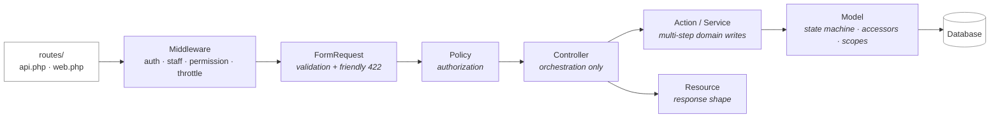
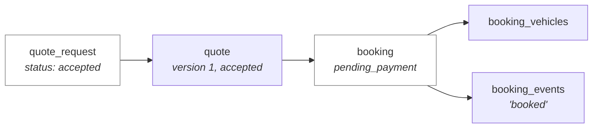
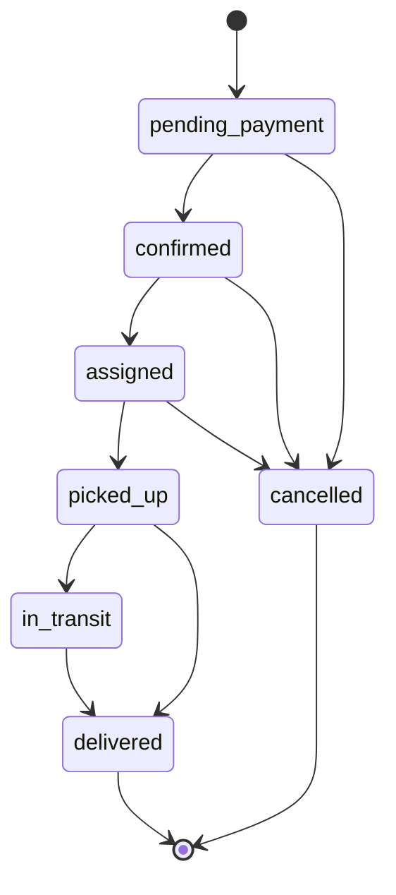
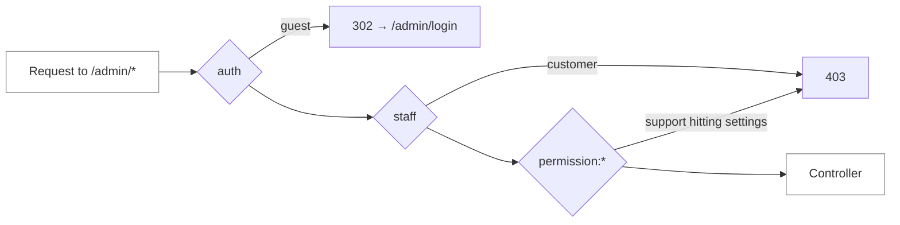

# AutoTransport — Backend

**Laravel 12 · PHP 8.2 · Sanctum · spatie/laravel-permission · spatie/laravel-activitylog**

Two HTTP surfaces over one domain layer: a JSON API at `/api/v1` for the mobile
client, and a server-rendered admin panel at `/admin` for staff.

**Related:** [`architecture.md`](architecture.md) (system view) ·
[`database-design.md`](database-design.md) (schema rationale) ·
[`mobile.md`](mobile.md) (the client) ·
[`product-spec.md`](product-spec.md) (features + wireframes)

---

## 1. What is here

| | Count | Notes |
|---|---:|---|
| Eloquent models | 27 | one per table, plus a `HasUlid` concern |
| Controllers | 23 | 13 API, 9 admin, 1 admin auth |
| Form requests | 14 | validation lives here, never in controllers |
| API resources | 10 | the response contract |
| Policies | 3 | Booking, QuoteRequest, Review |
| Blade views | 27 | admin panel, no build step |
| Migrations | 13 | run order is forced by foreign keys |
| Seeders | 5 | roles → catalog → content → demo |
| Tests | 8 files | **91 tests, 465 assertions** |

---

## 2. Layering



**Why validation and authorization are separate layers.** A `FormRequest` answers
*"is this input well-formed?"* and produces a 422 with a field-keyed error bag the
mobile form renders inline. A `Policy` answers *"may this person do this at
all?"* and produces a 403. Collapsing them means either leaking existence
information through validation messages, or returning 403s for typos.

`StoreReviewRequest` shows both working together: the *scoped* `exists` rule
(`->where('user_id', $this->user()->id)`) makes a stranger's booking ULID fail
identically to an invented one — the response never confirms the row exists —
while `ReviewPolicy` independently guarantees no other code path can skip the
ownership rule.

---

## 3. The API surface

31 routes under `/api/v1`. Public routes carry tight throttles because they are
unauthenticated write or compute endpoints.

| Group | Routes | Auth |
|---|---|---|
| Catalog | `services`, `services/{slug}`, `vehicle-types`, `locations`, `faqs`, `settings/public` | none |
| Reviews (public) | `services/{slug}/reviews` | none |
| Quoting | `quotes/estimate`, `quote-requests` (POST) | none, throttled |
| Contact | `contact-messages` | none, `throttle:5,1` |
| Auth | `register` `login` `forgot-password` `me` `logout` | mixed |
| Profile | `profile`, `profile/addresses/*` | `auth:sanctum` |
| Shipments | `bookings` (GET/POST), `{ulid}`, `{ulid}/events`, `{ulid}/cancel` | `auth:sanctum` |
| Reviews (write) | `reviews`, `reviews/{ulid}/helpful` | `auth:sanctum` |

### Throttling is two-layered on login

`throttle:6,1` per IP stops one attacker spraying many accounts. A per-account
lockout after five failures stops many IPs targeting one account. Either alone
leaves the other attack open.

`forgot-password` always answers `200` whether or not the address exists —
otherwise the response is an account-enumeration oracle.

### PATCH and PUT both reach profile updates

These are genuinely partial updates: the client sends only what the user touched
and the controller ignores anything it does not own (changing an email is an
identity change, not a profile edit). `PATCH` is the honest verb; `PUT` is
accepted alongside it because it is the reflex when hand-testing with curl, and a
405 is a confusing way to learn the difference.

---

## 4. The booking chain

`POST /api/v1/bookings` does not insert a booking. `App\Actions\BookService`
writes the whole chain in one transaction:



**Why not just insert a booking.** `bookings.quote_id` is nullable, so nothing at
the database level would catch a bare insert. But then an instantly-booked
shipment has no answer to *"what were they quoted, and when did they see it?"* —
the exact question §4.1 of the schema doc exists to protect, and it arrives from
a chargeback or a regulator rather than from curiosity.

**Why it opens at `pending_payment`, not `confirmed`.** The price is the
*automated estimate*. §7 of the schema doc is explicit that an estimate is not a
binding quote — booking at it means the business is committing to a
machine-generated number before a human has seen the lane. `pending_payment`
keeps a person in the loop, and the opening timeline event records that the price
came from the estimator.

**Why `issued_by` is null on the quote.** No human issued it. Attributing it to
the customer would corrupt "who quoted this" in the panel.

**Why `line1` is required for a booking but not for a quote request.** A quote can
be priced from a city pair; a booking is a driver turning up at a door.
`bookings.pickup_line1` is `NOT NULL` for that reason, and validating it in the
FormRequest turns a database 500 into a readable 422.

---

## 5. The booking state machine



`BookingStatus::allowedNext()` owns this. Two consequences:

- **The admin form only renders legal transitions.** Offering the full enum would
  manufacture flash errors on submit.
- **`Booking::transitionTo()` is the only sanctioned writer.** It validates the
  move, then writes the status *and* its timeline event in one transaction.
  Design doc §4.8 is explicit: never `UPDATE` a status without also `INSERT`ing an
  event.

Status is `VARCHAR` + a PHP enum, not a MySQL `ENUM`. Adding a state to a MySQL
`ENUM` is a locking `ALTER TABLE` coordinated with a deploy; adding a case to a
backed enum is a code change.

---

## 6. Admin panel

Server-rendered Blade, hand-written CSS, **no build step**. `public/css/admin.css`
is 2,857 lines; `public/js/admin.js` is 106 lines and is enhancement-only — every
screen works with it absent.

### Access control has two layers, both load-bearing



`staff` is the coarse gate — *authenticated is not the same as employed*, and a
customer with a valid session must not reach the panel at all. `permission:*` is
what stops a support agent reaching settings while still letting them work the
review queue.

The permission middleware is referenced as a **class** (`PermissionMiddleware::using(…)`)
rather than through the `'permission'` string alias, so the routes hold
regardless of what `bootstrap/app.php` happens to alias.

`Route::redirect('/login', '/admin/login')->name('login')` exists because
Laravel's auth middleware resolves `route('login')` when converting an
`AuthenticationException` into a redirect. Without a route of that name, guests
get a 500 instead of a login page.

### Progressive enhancement is a real constraint, not a slogan

Rejecting a review needs a reason, and the reason field lives in a
`<details>` disclosure rather than a JS modal — it works with JavaScript off.
Logout is `POST` only, because a `GET` logout is CSRF-able from an `` tag.

### The settings form has two conventions the Blade must honour

Both exist because *absence is ambiguous*:

- a **bool** row ships a hidden `0` immediately before its checkbox, so unchecked
  arrives as `0` rather than vanishing;
- an **encrypted** row may be left blank, meaning *keep the stored secret*.
  Writing `''` would break an integration and leave no way to tell an emptied key
  from an unset one.

Settings post as `settings[<id>]`, keyed by primary key rather than
`"group.key"` — a key may itself contain a dot (`map.center.lat`), and a dot in a
validation attribute name means *nested array*.

---

## 7. Roles and permissions

Six roles, 14 permissions, seeded by `RolePermissionSeeder`.

| Role | Permissions | Reach |
|---|---:|---|
| `super-admin` | 14 | everything, including settings and the grant matrix |
| `admin` | 13 | operations manager |
| `dispatcher` | 5 | quotes, bookings, carrier assignment |
| `support` | 5 | messages, review moderation, read-only bookings |
| `driver` | 0 | own assigned bookings (via API, not the panel) |
| `customer` | 0 | own quotes, bookings, reviews |

Roles are rows, not a `type` column on `users`, so a dispatcher can also be a
driver without a second identity. Driver-only attributes live in
`driver_profiles`.

The grant matrix rides on `manage_users`: **editing what a role may do is the
same power as deciding who holds it**, so gating them differently would be
security theatre.

**The super-admin password is never hardcoded.** It comes from `ADMIN_PASSWORD`
in `.env`; in production with nothing set, a random one is generated and printed
once. Re-seeding never rewrites an existing admin password — an operator who
rotated it in the panel would otherwise find `db:seed` quietly reverting them.

---

## 8. Error shaping

`bootstrap/app.php` pins three JSON shapes because the client reads exactly
`response.data.message` and `response.data.errors`:

| Exception | Status | Body |
|---|---|---|
| `AuthenticationException` | 401 | `{ message, errors: {} }` |
| `AuthorizationException` / `AccessDenied` | 403 | `{ message, errors: {} }` |
| `ModelNotFound` / `NotFoundHttp` | 404 | `{ message: "Resource not found.", errors: {} }` |
| `ValidationException` | 422 | framework default (already correct) |

`errors` is cast to an **object** so it serialises as `{}` rather than `[]` —
`ApiError.errors` is typed `Record<string, string[]>` on the client, and an empty
PHP array encodes as a JSON array.

JSON is forced for `api/*` **or** `expectsJson()`. A gateway webhook or a curl
call without an `Accept` header must still get JSON, never an HTML error page and
never a redirect to a login route the API does not own.

---

## 9. Testing

```bash
cd backend && php artisan test
```

**91 tests, 465 assertions.** `phpunit.xml` pins `DB_DATABASE=:memory:`, so tests
never touch the development SQLite file.

`AdminPanelSmokeTest` renders **every** admin page against real seeded rows.
`php artisan view:cache` only proves a template *parses* — it says nothing about a
view reading a property the model does not expose, calling a relation that was
never eager-loaded, or a `route()` naming a route that does not exist. All three
are runtime failures on a page a human has to open.

Two assertions there are security regression alarms rather than feature tests:
a customer with a valid session gets 403 from the panel, and a `support` user gets
200 on reviews but 403 on settings. If either starts passing differently, the
middleware has come unwired.

---

## 10. Seeding

Order is forced by foreign keys and role lookups:

```
RolePermissionSeeder  →  CatalogSeeder  →  ContentSeeder  →  DemoDataSeeder
   roles, permissions,     vehicle types,    system pages,     sample customers,
   super-admin            categories,       settings,         shipments, reviews
                          services          primary location
```

`DemoDataSeeder` is skipped when `APP_ENV=production` — a live database must never
receive fixture data.

> **`DatabaseSeeder` deliberately does not use `WithoutModelEvents`,** which the
> Laravel stub ships with by default. That trait suppresses `creating`/`created`
> for the whole run, and `HasUlid` populates `ulid` from the `creating` hook —
> with the trait on, every seeded row fails the `NOT NULL` constraint, and where a
> column happens to be nullable it inserts blank instead, which is worse.
> `ReviewObserver`'s aggregate maintenance hangs off the same events.

---

## 11. Operational commands

```bash
php artisan migrate:fresh --seed     # rebuild from zero (destroys local data)
php artisan reviews:rebuild-aggregates   # recompute rating_avg from source
php artisan route:list --path=api    # the server half of the client contract
php artisan test                     # 91 tests
```

`reviews:rebuild-aggregates` is not optional tooling. `services.rating_avg` is
maintained by an observer; if a listener ever fails, the cached number is wrong
forever with no self-correction. This is the rebuild path that makes the
denormalisation safe.
