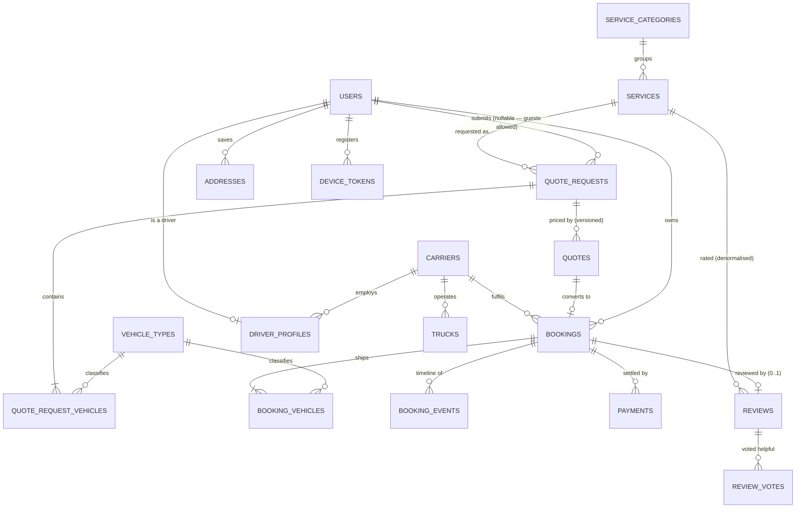
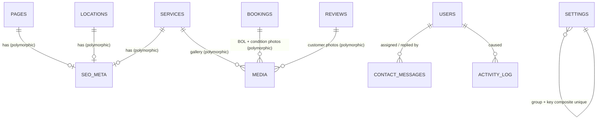

# Auto Transport Platform — Database Design

**Stack:** Laravel 12 (API) · MySQL 8.0 · React Native (Expo) client · Filament or Next.js admin
**Charset:** `utf8mb4` / `utf8mb4_0900_ai_ci` · **Engine:** InnoDB · **Timezone:** all timestamps UTC

---

## 1. Domain model in one paragraph

A visitor submits a **quote request** describing one or more **vehicles**, an origin, a destination and a date window. Staff price it and issue a **quote** (a versioned, expiring offer). If the customer accepts, the quote becomes a **booking** — a real shipment with a snapshotted price and addresses. A **carrier** and **driver** are assigned, **booking events** record the timeline from dispatch to delivery, **payments** settle the money, and once delivered the customer may leave exactly one **review**. Everything the marketing site shows — services, terminals, FAQs, page copy, SEO tags — is admin-editable content.

## 2. Bounded contexts

| Context | Tables |
|---|---|
| **Identity & Access** | `users`, `roles`, `permissions`, `model_has_roles`, `model_has_permissions`, `role_has_permissions`, `addresses`, `device_tokens`, `personal_access_tokens` |
| **Catalog** | `service_categories`, `services`, `vehicle_types`, `locations` |
| **Supply** | `carriers`, `driver_profiles`, `trucks` |
| **Sales pipeline** | `quote_requests`, `quote_request_vehicles`, `quotes` |
| **Fulfilment** | `bookings`, `booking_vehicles`, `booking_events` |
| **Money** | `payments`, `payment_webhooks` |
| **Reputation** | `reviews`, `review_votes` |
| **Content & SEO** | `pages`, `seo_meta`, `faqs`, `contact_messages`, `settings` |
| **Cross-cutting** | `media`, `activity_log`, `notifications`, `jobs`, `cache` |

Contexts talk to each other through foreign keys in one direction only: Catalog ← Sales ← Fulfilment ← Money/Reputation. Nothing upstream depends on anything downstream, so you can delete a `service` (soft) without cascading damage into historical bookings.

---

## 3. Entity relationship diagram

### 3.1 Core transaction flow



### 3.2 Content, SEO and cross-cutting



---

## 4. Design decisions, and why

### 4.1 `quote_requests` and `quotes` are two tables, not one

This is the single most consequential call in the schema, so it goes first.

A naive design puts `estimated_price` on the request row and updates it when staff price the job. That destroys information. In auto transport, prices get revised — the carrier falls through, fuel moves, the customer says "what if I'm flexible on dates". If you overwrite, you cannot answer *"what did we quote this customer on 3 March, and did they see it before it expired?"* Six months later that question arrives from a chargeback dispute or a regulator, not from curiosity.

So:

* **`quote_requests`** is the customer's submission. Treat it as **append-only intake**. Its `estimated_price_cents` is the *instant automated estimate* shown on the website — a marketing number, never a commitment.
* **`quotes`** are staff-issued offers. Re-pricing **inserts a new row with `version = n+1`** and marks the previous one `superseded`. `UNIQUE (quote_request_id, version)` makes skipping or duplicating a version impossible at the storage layer.

`valid_until` plus the `(status, valid_until)` index gives a cheap scheduled sweeper:

```sql
UPDATE quotes SET status = 'expired'
WHERE status IN ('sent','viewed') AND valid_until < NOW();
```

**When to collapse this:** if you never negotiate and every lead gets exactly one price, fold `quotes` into `quote_requests` and save a join. You can always split it back out later — going the other direction (recovering lost history) is impossible.

### 4.2 Vehicles are child rows, never repeated columns

Customers routinely ship two or three cars in one move. `vehicle_1_make`, `vehicle_2_make` is the classic trap: it caps you at whatever N you guessed, makes "how many Teslas did we move last quarter" a `UNION` of column scans, and forces a migration when someone ships four.

`quote_request_vehicles` and `booking_vehicles` are proper one-to-many children. `quote_requests.vehicle_count` is a **denormalised counter** kept in sync by a model observer — it exists purely so the admin lead list can show "3 vehicles" without an N+1 or a correlated subquery across a thousand rows.

`is_operable` deserves its own boolean rather than living in a notes field. A non-running vehicle needs a winch, which changes the price materially and filters which carriers can even bid. It is a first-class pricing input, so it gets a first-class column.

### 4.3 Addresses are snapshotted onto bookings, not foreign-keyed

`addresses` exists for convenience — the app pre-fills "ship from my saved Home address". But `bookings` stores **flat copies** of the pickup and dropoff fields.

The reason is temporal integrity. If a booking pointed at `address_id = 42` and the customer later edits that address after moving house, your delivered shipment record silently rewrites itself to claim it was delivered to an address it never went to. Every invoice, BOL and dispute record downstream becomes wrong. Financial and legal records must capture facts **as they were at the time of the transaction**.

Same principle drives `bookings.total_price_cents` (copied from the accepted quote), `payments.card_last4`, and `reviews.service_id`. **Snapshot anything that appears on a document a human might later rely on.**

The cost is ~20 extra columns on `bookings` and no referential enforcement on those values. That is the correct trade. If the width bothers you, move each side into a `json` column (`pickup_address`, `dropoff_address`) — MySQL 8 can index generated columns off JSON paths — but flat columns index and query more simply, and you *will* be querying by `pickup_postal_code` for lane analytics.

### 4.4 Money is integer minor units, always

Every monetary column is `unsignedBigInteger('*_cents')` with a sibling `currency CHAR(3)`.

`FLOAT`/`DOUBLE` cannot represent 0.1 exactly; summing a thousand deposits accumulates drift that surfaces as a reconciliation mismatch nobody can explain. `DECIMAL(10,2)` is correct in the database but PHP reads it back as a float string and the same problem re-enters at the application boundary. Integers are exact end to end, and every payment gateway API (Stripe, SSLCommerz, bKash) already speaks minor units — so you also eliminate conversion at the integration seam.

Cast them with a money value object, or at minimum an accessor:

```php
protected function totalPrice(): Attribute
{
    return Attribute::get(fn () => $this->total_price_cents / 100);
}
```

Never let the raw division leak into a `sum()`.

### 4.5 Public identifiers are ULIDs; primary keys stay `BIGINT`

Every externally-visible entity carries `ulid` alongside its auto-increment `id`. The API routes on ULID; the database joins on `BIGINT`.

Sequential integers in URLs leak two things. First, **volume** — `/api/bookings/1847` tells a competitor you have done 1,847 bookings, and the delta between two probes a month apart gives them your growth rate. Second, they invite **IDOR probing**: enumeration is trivial, so a single missing authorization check becomes a full-table read rather than one leaked record. ULIDs remove enumeration as an attack primitive. They remain lexicographically sortable by creation time, unlike UUIDv4, so an index on them doesn't fragment.

Keeping `BIGINT` internally matters because InnoDB clusters on the primary key: a 16-byte random PK bloats every secondary index and fragments inserts. You get the security property without the write-amplification.

This is defence in depth, **not** a substitute for authorization. Every endpoint still needs a policy check — ULIDs just mean a bug leaks one record instead of the whole table.

Human-facing references (`QR-2026-0001842`, `BK-2026-000318`) are separate again, because customers read them over the phone.

### 4.6 Status is `VARCHAR` + PHP enum, not MySQL `ENUM`

Adding a state to a MySQL `ENUM` is an `ALTER TABLE` — a locking operation on a large table, coordinated with a deploy. Adding a case to a PHP backed enum is a code change. Keep the vocabulary in `app/Enums/`, cast on the model:

```php
protected function casts(): array
{
    return ['status' => BookingStatus::class];
}
```

`BookingStatus::allowedNext()` encodes the state machine so an invalid transition (delivered → in_transit) is rejected in one place rather than in every controller. Add a CHECK constraint if you want belt-and-braces:

```sql
ALTER TABLE bookings ADD CONSTRAINT bookings_status_chk
CHECK (status IN ('pending_payment','confirmed','assigned','picked_up','in_transit','delivered','cancelled'));
```

### 4.7 Review integrity is enforced by the database

Ratings are worth exactly as much as their credibility. Three constraints, in the schema rather than in a controller:

1. `booking_id` is `UNIQUE` → **one review per shipment**, no review-bombing.
2. `booking_id` is `NOT NULL` → **no review without a transaction**. There is no path to a review that isn't anchored to a real delivered job.
3. `status DEFAULT 'pending'` → **nothing is public until moderated**. Fail closed.

The application layer adds two checks a foreign key can't express: `booking.status === Delivered` and `booking.user_id === review.user_id`.

`is_verified` is therefore always true for reviews created through this flow, and exists only for imported legacy or Google-syndicated reviews where the linkage is absent. Do not let it become a settable field in the admin panel.

**Sub-ratings** (`communication`, `timeliness`, `condition`, `value`) are separate columns rather than a `review_criteria` pivot. A pivot would be more flexible but turns "average condition rating for enclosed transport" into a four-table join, and the criteria for a vehicle shipment are stable — they will not change quarterly. Columns win here.

`rating_condition` is the one that matters commercially: it asks whether the car arrived as it left, which is the entire promise of the service.

**Aggregates are denormalised.** `services.rating_avg` / `rating_count` and the same pair on `carriers` and `driver_profiles` are maintained by a listener on review approval:

```php
$service->rating_count = $service->approvedReviews()->count();
$service->rating_avg   = $service->approvedReviews()->avg('rating_overall');
```

Computing `AVG()` on every services-page render is a full scan of the reviews table per request, and the services page is your highest-traffic SEO surface. The tradeoff is drift — if a listener fails, the cached number is wrong forever with no self-correction. Ship a nightly `reviews:rebuild-aggregates` command that recomputes from source. Denormalisation without a rebuild path is a bug waiting to be discovered by a customer.

### 4.8 `booking_events` is append-only

Never `UPDATE` a status without also `INSERT`ing an event. This one table gives you three things for the price of one:

* the **tracking timeline** the RN app renders,
* the **audit trail** for "who marked this delivered and when",
* the **on-time KPI**, via `actual_pickup_at` vs `scheduled_pickup_date`.

`is_customer_visible` lets dispatch record internal notes ("carrier ghosting, rebooking") on the same timeline without exposing them. The RN app filters on it; the admin panel doesn't.

`lat`/`lng` on the event row means location pings from the driver app are just another event type — no separate tracking table, and the position history is intrinsically ordered by `occurred_at`.

### 4.9 `seo_meta` is polymorphic

`pages`, `services` and `locations` all need meta title, description, OG tags and JSON-LD. Three sets of duplicated columns means three admin forms to keep in sync, and a fourth entity next quarter means a fourth.

One polymorphic table, one `<SeoFields>` admin component, one `MetaTag` renderer. `UNIQUE (metable_type, metable_id)` keeps it strictly one-to-one.

Column lengths encode SEO reality: `meta_title` is capped at 70 and `meta_description` at 160 because that is roughly where Google truncates. The database refuses to store something that would render broken.

`schema_json` holds JSON-LD. For an auto transport company the ones that pay off are `LocalBusiness` (address + `geo` from `locations`, hours from `locations.hours`), `Service` per service page, and `AggregateRating` fed directly from `services.rating_avg` / `rating_count` — which is the concrete SEO reason those denormalised columns earn their keep.

**Polymorphic costs, stated plainly:** no foreign key enforcement, so an orphaned `seo_meta` row survives a hard-deleted page. The `(metable_type, metable_id)` composite index is mandatory, not optional, or every page render table-scans. If you only ever have three metable types, three nullable column groups would genuinely be defensible — polymorphism pays off from about the fifth type onward.

### 4.10 Guest quote requests

`quote_requests.user_id` is **nullable**. Forcing registration before a price quote is a conversion killer in this industry; the form must work for an anonymous visitor.

`contact_email` is indexed so that when that visitor later registers with the same address, you can claim their history:

```php
QuoteRequest::whereNull('user_id')
    ->where('contact_email', $user->email)
    ->update(['user_id' => $user->id]);
```

Run this **only after `email_verified_at` is set**. Claiming on registration alone lets anyone type a stranger's email and inherit their quote history — including addresses and vehicle VINs. This is the sharpest edge in the schema; the nullable FK is what makes the vulnerability reachable, so the verification gate is load-bearing.

### 4.11 Payments are an append-only ledger

A refund is a **new row** with `type = 'refund'` and `refunds_payment_id` pointing at the original capture — never a mutation of the captured row. `bookings.amount_paid_cents` is the signed sum of captured rows. This is a ledger; ledgers don't get edited.

`idempotency_key` is `UNIQUE`. A user double-taps "Pay" on a flaky mobile connection, the client retries, and the unique index turns the second insert into a caught exception instead of a double charge.

`payment_webhooks` stores the raw callback **before** processing, with `UNIQUE (gateway, event_id)` for replay protection and `signature_valid` recorded as data. When a handler throws at 3am you replay from your own table rather than begging the gateway to resend. `processed_at IS NULL` is your dead-letter queue.

`card_last4` and `card_brand` are the only card fields present. **No PAN, no CVV, no expiry** — those never touch this database under any circumstance. Tokenise at the gateway. Note that `gateway_payload` is a `json` column that will happily swallow a full card object if you dump the raw response into it; filter it on write.

### 4.12 PII handling

`users.phone` is plaintext because you need to search and dial it. If regulation demands encryption at rest, the pattern is a paired column: `phone_encrypted` (Laravel `encrypted` cast) plus `phone_normalized` (E.164) for indexed lookup. You cannot index a ciphertext column meaningfully — encryption and query are in direct tension, and this is the standard resolution.

Note that `phone_normalized` is a deterministic derivative and leaks membership: an attacker with the table can confirm whether a known phone number is a customer. Hash it with a server-side pepper if that matters for your threat model.

`ip_address` columns on `quote_requests`, `contact_messages` and `reviews` are `VARCHAR(45)` (IPv6-sized) and exist for abuse forensics. They are personal data under GDPR — set a retention policy and prune on schedule rather than accumulating them indefinitely.

Financial and shipment rows use `softDeletes`; "delete my account" anonymises `users` (scramble name/email, null the phone) while preserving `bookings` and `payments`, because tax and carrier-liability records outlive the customer relationship.

---

## 5. Indexing strategy

Every index below answers a specific query the application actually runs. Composite column order follows equality-then-range.

| Index | Serves |
|---|---|
| `qr_status_created_idx (status, created_at)` | Admin lead queue: open requests, newest first |
| `qr_assignee_status_idx (assigned_to, status)` | "My leads" for a dispatcher |
| `qr_lane_idx (pickup_postal_code, dropoff_postal_code)` | Lane volume + pricing analytics |
| `bookings_user_status_idx (user_id, status)` | "My shipments" — the RN app's hottest query |
| `bookings_dispatch_idx (status, scheduled_pickup_date)` | Dispatch board: confirmed jobs by date |
| `bookings_driver_idx (driver_id, status)` | Driver app's job list |
| `booking_events_timeline_idx (booking_id, occurred_at)` | Tracking screen, already ordered |
| `reviews_moderation_queue_idx (status, created_at)` | Pending-review admin queue |
| `reviews_service_agg_idx (service_id, status, rating_overall)` | Covering index for aggregate rebuild |
| `payments_gateway_ref_idx (gateway, gateway_reference)` | Webhook → payment lookup |
| `media_model_collection_idx (model_type, model_id, collection)` | Mandatory for any polymorphic fetch |
| `services_active_sort_idx (is_active, sort_order)` | Public services listing |

Two rules to keep in mind as you extend this:

* MySQL uses a composite index **left-to-right only**. `(status, created_at)` accelerates `WHERE status = ?` and `WHERE status = ? ORDER BY created_at`, but does nothing for `WHERE created_at > ?` alone.
* Booleans alone are near-useless as index keys (cardinality 2). `is_active` earns its place only as the *leading* column of a composite where `sort_order` follows.

---

## 6. Seed data required for a working system

`DatabaseSeeder` must produce these or the app has no functioning defaults:

1. **Roles + permissions** — the six roles from `UserRole`, with a permission per admin resource (`view_bookings`, `moderate_reviews`, `manage_settings`, …).
2. **A super-admin user** — credentials from `.env`, never hardcoded.
3. **Vehicle types** — Sedan (1.0), Coupe (1.0), SUV (1.15), Pickup (1.2), Minivan (1.15), Motorcycle (0.6), Heavy/Oversize (1.8). Multipliers are the starting point of the pricing engine.
4. **Service categories + services** — Open Carrier, Enclosed Carrier, Door-to-Door, Terminal-to-Terminal, Expedited, Motorcycle Transport, Heavy Equipment.
5. **System pages** — `home`, `about`, `services`, `contact` with `is_system = true` so the admin panel can't delete them out from under the router.
6. **Settings** — `contact.phone`, `contact.email`, `contact.map_lat`, `contact.map_lng`, `contact.map_zoom`, `pricing.deposit_percent`, `pricing.quote_validity_days`, `seo.default_title`, `seo.default_description`.
7. **Primary location** — one `locations` row with `is_primary = true`; its lat/lng is what the Contact page Google Maps embed centres on.

---

## 7. Estimator query (the instant website quote)

```
price = max(
    service.min_price_cents,
    service.base_price_cents
      + (distance_miles × service.price_per_mile_cents)
) × Σ(vehicle_type.price_multiplier)
  × (is_operable ? 1.0 : 1.35)
```

Cache `distance_miles` on `quote_requests` when it is first computed. The Google Distance Matrix API is billed per call and the same lane is requested repeatedly — a `(pickup_postal_code, dropoff_postal_code) → miles` cache table or Redis key pays for itself in the first week.

This estimate is explicitly **not** the quote. Store it, show it with a "subject to confirmation" caveat, and let a human issue the binding `quotes` row.

---

## 8. Migration run order

```
0001_01_01_000000  create_users_table          (framework default)
0001_01_01_000001  create_cache_table          (framework default)
0001_01_01_000002  create_jobs_table           (framework default)
2026_01_01_000100  create_identity_tables      ← alters users, adds RBAC
2026_01_01_000200  create_catalog_tables
2026_01_01_000300  create_carrier_tables
2026_01_01_000400  create_quote_tables
2026_01_01_000500  create_booking_tables
2026_01_01_000600  create_payment_tables
2026_01_01_000700  create_review_tables
2026_01_01_000800  create_content_tables
2026_01_01_000900  create_media_and_audit_tables
```

Order is forced by foreign keys: catalog before quotes, quotes before bookings, bookings before payments and reviews. `php artisan migrate:fresh --seed` should run clean top to bottom.

---

## 9. Deliberate omissions

Left out to keep the MVP honest — add when the need is real, not before:

* **`invoices`** — `bookings` + `payments` covers billing until you need formal sequential invoice numbering for tax filing.
* **`conversations` / `messages`** — in-app chat between customer and dispatcher. Real feature, separate context, don't inline it into `booking_events`.
* **Carrier bidding / load board** — `carrier_bids` on a booking. Only meaningful once you have carrier supply competing for loads.
* **`coupons` / `discounts`** — a discount column on `quotes` handles the first twenty promotions.
* **PostGIS / MySQL spatial** — `decimal(10,7)` lat/lng is fine for point storage and display. Switch to a `POINT` column with a `SPATIAL` index when you need "carriers within 50 miles of this pickup", which is a dispatch-optimisation feature, not a launch feature.
