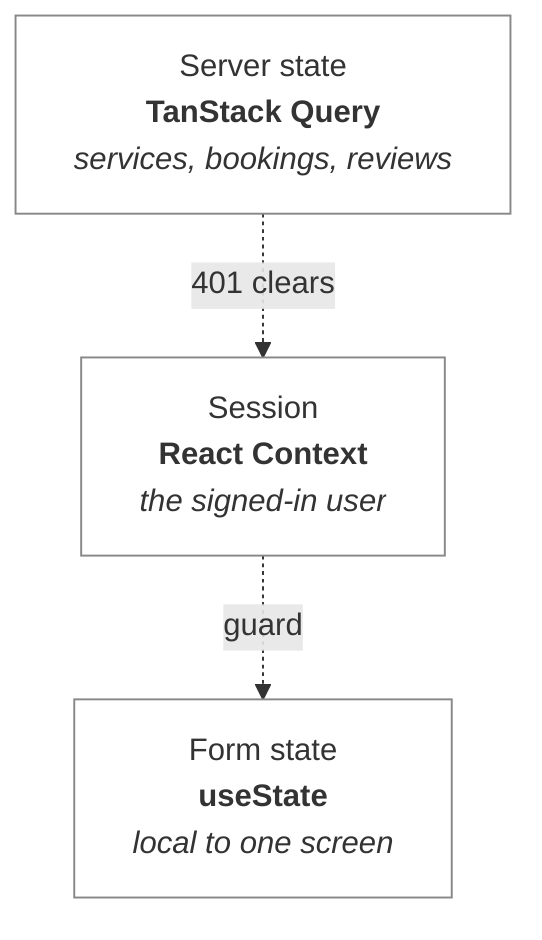
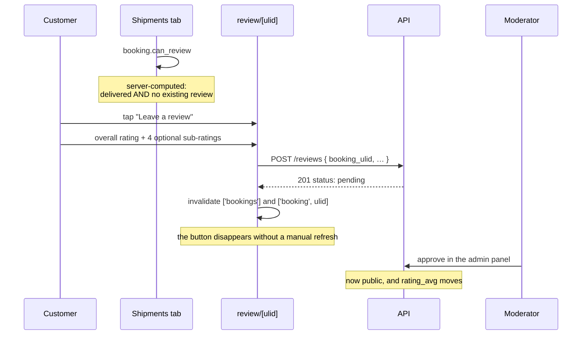

# AutoTransport — Mobile Client

**Expo SDK 57 · React 19 · React Native 0.86 · expo-router · TanStack Query · zod**

The customer-facing app: browse services, book a shipment, track it, review it
once delivered, and contact the company.

> **Read the versioned docs before writing code here.** `mobile/AGENTS.md` says
> so for a reason — SDK 56 removed support for importing `@react-navigation/*`
> in application code, and `Stack.Protected` replaced the older imperative
> redirect pattern for auth guards. Guidance written for SDK 50 is actively
> wrong. <https://docs.expo.dev/versions/v57.0.0/>

**Related:** [`architecture.md`](architecture.md) · [`backend.md`](backend.md)

---

## 1. Route tree

Every file under `app/` is a route. `expo-router` is file-system based, so the
tree *is* the navigation graph.

```
app/
├── _layout.tsx            providers + the auth guard
├── (auth)/
│   ├── _layout.tsx
│   ├── login.tsx
│   └── register.tsx
├── (tabs)/
│   ├── _layout.tsx        4 tabs
│   ├── index.tsx          Services  — browse and book
│   ├── bookings.tsx       Shipments — the review entry point
│   ├── contact.tsx        Contact form
│   └── account.tsx        Profile + sign out
├── service/[slug].tsx     detail, pricing, public reviews
├── book/[slug].tsx        the booking form
├── booking/[ulid].tsx     tracking timeline
├── review/[ulid].tsx      post-service review (modal)
└── +not-found.tsx
```

Parenthesised segments are **groups**: they organise files without adding a URL
segment. `(tabs)/index.tsx` is `/`, not `/tabs`.

---

## 2. The auth guard

```tsx
<Stack screenOptions={{ headerShown: false }}>
  <Stack.Protected guard={user !== null}>
    <Stack.Screen name="(tabs)" />
    …
  </Stack.Protected>

  <Stack.Protected guard={user === null}>
    <Stack.Screen name="(auth)" />
  </Stack.Protected>
</Stack>
```

`Stack.Protected` swaps which group is reachable as `user` changes. **There is no
imperative redirect to race the first paint** — the older `useEffect` +
`router.replace` pattern flashes the wrong screen for a frame and is a known
source of navigation loops.

Two consequences worth internalising:

- **Sign-in and sign-out navigate nothing.** `signIn()` sets `user`; the guard
  re-renders and the tab group becomes reachable on its own. A `router.push` after
  login is redundant and fights the guard.
- **The splash screen must stay up until the stored token has been checked.**
  `RootNavigator` returns `null` while `isLoading` is true. Hiding it earlier
  shows the sign-in screen for a frame to somebody who *is* signed in — brief, but
  it reads as being logged out, which is alarming in an app holding shipment
  records.

---

## 3. State: three layers, three owners



**Why the session is Context and not a module-level store.** The `Stack.Protected`
guard has to re-render when auth changes. A value read from outside React would
not trigger that.

**Why server data is not in the session.** Bookings and services have cache
lifetimes, refetch semantics and loading states; the signed-in user has none of
those. Query owns the first, Context owns the second.

`QueryClient` defaults: `retry: 1`, `staleTime: 30s`, `refetchOnWindowFocus:
false`. A phone loses signal constantly — one silent retry absorbs a tunnel, more
than that just delays telling the user what went wrong.

### The 401 path

`src/api/client.ts` clears the token on any 401 and calls a handler the session
registers. Without that, a token revoked while the app was closed leaves the user
on a private screen rendering empty forever.

Sign-out clears locally **even if the network call fails**. A user who taps "sign
out" on a dead connection must not stay signed in on the device; the server token
expires on its own, and leaving a live session on a handset the user believes they
logged out of is the worse of the two failures.

---

## 4. Token storage — the platform split

`expo-secure-store` **has no web implementation** (SDK 57: *"Web is not
supported"*). `app.json` configures a web bundler, so the web target is real here
and an unguarded call throws rather than degrading.

`src/lib/storage.ts` therefore splits:

| Platform | Backing store |
|---|---|
| iOS | Keychain |
| Android | Keystore |
| Web | `localStorage` |

**The fallback is genuinely weaker and the file says so.** `localStorage` is
readable by any script that achieves XSS on the origin. That is acceptable for a
browser preview of a mobile app. If the web build ever becomes a product surface,
the fix is an httpOnly cookie — not hardening that file, because a token
JavaScript can read is a token XSS can steal no matter where it is stashed.

Never `AsyncStorage`: plaintext on a rooted or jailbroken device.

---

## 5. The API seam

```
src/api/endpoints.ts   route strings   ← must match backend/routes/api.php
src/types/api.ts       response shapes ← must match app/Http/Resources/*
src/types/schemas.ts   zod validation  ← mirrors the Laravel FormRequests
```

**Nothing links these to the server mechanically.** TypeScript will happily
type-check a string that no longer routes anywhere; a renamed route is a silent
404 at runtime. `php artisan route:list --path=api` is the check. See
[`architecture.md` §5](architecture.md#5-the-contract-seam-and-why-it-is-the-sharpest-edge-here)
for the incident that made this concrete.

**zod is for instant feedback, not safety.** The server re-validates everything.
Client validation exists so a typo surfaces before a round trip — it is never the
security boundary, and `schemas.ts` says so at the top.

**Money never gets divided in a template.** The API sends
`{ cents: 19500, currency: "USD" }`; `formatMoney()` in `types/api.ts` is the only
thing that turns it into text.

**Identifiers are ULIDs.** `booking_ulid`, not `booking_id` — the integer id is
never emitted by the API, so the client cannot hold one.

---

## 6. The review flow

The feature the whole app exists to close the loop on.



**`can_review` is computed by the server.** Deciding it on the client would mean
duplicating the rule and getting it wrong the first time the state machine
changes.

**Stars are five discrete buttons, not a swipe gesture.** Each carries its own
label ("3 of 5 stars"). A discrete button is reachable by switch control and by a
screen reader, and it works with a thumb in a cold car park — which is roughly
where this form gets filled in.

**Skipped sub-ratings send `null`, not `0`.** Zero would fail the `between:1,5`
rule; `null` is what the API documents as *skipped*.

The screen says up front that reviews are checked before appearing publicly.
Discovering that later, when the review fails to show up, reads as a bug.

---

## 7. The booking form

`book/[slug].tsx` takes its service from the route but keeps it **editable** via a
chip row. Tapping the wrong card otherwise means backing out and losing a
half-filled form, and *which transport option* is exactly the decision a customer
revisits once they see the price.

Other decisions worth knowing:

- **Vehicle type is chips, not a picker.** `@react-native-picker` is another
  native dependency, and the options fit on screen.
- **The runs / non-runner toggle is not cosmetic.** A non-running vehicle needs a
  winch, which is +35% and limits which carriers can bid. It is a first-class
  pricing input, and the UI says why.
- **Street address is required.** `bookings.pickup_line1` is `NOT NULL` — a driver
  cannot collect from a city name.
- **The estimate caveat is shown before submitting**, not after. A customer who
  believes the estimate is binding will be angry at the confirmation call rather
  than at a sentence on the form.

---

## 8. Design system

`src/theme/tokens.ts` holds colour, spacing, radius and type. `useTheme()` returns
the light or dark palette. **No screen contains a raw hex value** — that is what
makes dark mode a single lookup rather than an audit of every `StyleSheet`.

Spacing is a 4pt scale. Arbitrary values are what make a layout look subtly wrong
in a way nobody can point at.

`src/components/ui.tsx` is the shared kit: `Screen`, `Card`, `Row`, `Txt`,
`Button`, `Field`, `Badge`, `Stars`, `Empty`, `Loading`, `ErrorNote`.

### Accessibility decisions that are easy to get wrong

- **`HIT_TARGET = 44`.** The Apple HIG floor, close enough to Android's 48dp that
  one number serves both. Smaller targets fail people with motor impairments
  first and everyone else in a moving vehicle second.
- **Decorative glyphs are hidden.** Star rows and tab icons carry `aria-hidden` /
  `importantForAccessibility="no"`, with the real value on the wrapper. Otherwise a
  screen reader announces "star star star star star", which conveys nothing.
- **`ErrorNote` is a live region.** A failed submit is otherwise silent for anyone
  who cannot see the red box.
- **Autofill hints are exact.** `autoComplete="new-password"` on registration is
  what prompts the platform password manager to offer to generate and save one;
  `current-password` on login does not.

---

## 9. Verifying a change

```bash
cd mobile
npx tsc --noEmit                 # types, including generated route types
npx expo export --platform android   # proves it bundles
npx expo start --web             # run it
```

> ### The stale-route-manifest trap
>
> **`expo-router` builds its route manifest when the dev server starts.** Adding a
> new file under `app/` while the server is running does **not** always register
> the route — the browser keeps serving a bundle that has no knowledge of it, and
> the new screen is simply unreachable. Hot reload updates *edited* files, which
> makes this especially confusing: your edits appear, your new screen does not.
>
> This happened during construction: the booking route existed on disk, type-checked,
> and had passing backend tests, while the served bundle contained neither the
> route nor the Book buttons. **Restart with `npx expo start --clear` after adding
> a route**, and verify by grepping the served bundle rather than trusting the file
> system:
>
> ```bash
> curl -s "http://localhost:8081/node_modules/expo-router/entry.bundle?platform=web&dev=true" | grep -c "book/\[slug\]"
> ```
>
> The same staleness affects `.expo/types/router.d.ts`, which is why `tsc` may
> reject a valid `href` after you add a screen. Regenerating the types resolves it.

---

## 10. Declared but unused dependencies

`package.json` carries several packages nothing imports. They came from the Expo
template and from a planned scope that has not been built:

| Package | Intended for |
|---|---|
| `zustand` | superseded — session state is React Context (§3) |
| `react-hook-form`, `@hookform/resolvers` | forms are `useState`; the app's forms are small |
| `react-native-maps` | tracking map on the booking screen |
| `expo-location` | driver location pings |
| `expo-notifications` | push on status change (`device_tokens` exists server-side) |
| `date-fns` | dates are ISO strings formatted by slicing |
| `expo-symbols` | superseded — tab icons are glyphs, no native dependency |

They are listed rather than removed because several are genuinely next on the
roadmap. **They are not free:** each is resolved at install and some add native
weight to a build. Prune anything that stops being planned.
