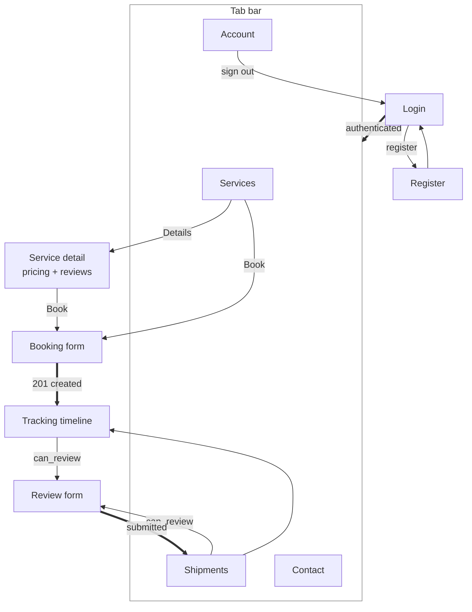
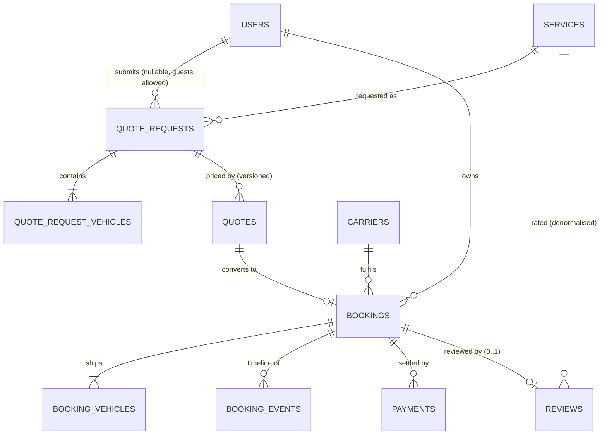

# AutoTransport — Wireframes, Schema and Feature List

A single answer to "what does this product do, what does it look like, and what
is it built on". Status is read from the code, not from a plan.

**Companion documents:** [`architecture.md`](architecture.md) (how it fits together) ·
[`database-design.md`](database-design.md) (why the schema is shaped this way) ·
[`backend.md`](backend.md) · [`mobile.md`](mobile.md)

---

## 1. Feature list

Legend: **✅ built and covered by tests** · **◐ partial — works, with a stated gap** · **✗ not built**

### 1.1 Customer app

| # | Feature | Status | Notes |
|---|---|:--:|---|
| 1 | Register | ✅ | name, email, phone, password + confirmation |
| 2 | Log in / log out | ✅ | Sanctum token in Keychain/Keystore |
| 3 | Forgot password | ◐ | issues a real reset link; `MAIL_MAILER=log` in dev, so the mail lands in the log |
| 4 | Browse transport options | ✅ | 7 seeded services with pricing and transit times |
| 5 | Service detail + public reviews | ✅ | rating average, sub-ratings, owner replies |
| 6 | **Book a shipment** | ✅ | addresses, date, up to 8 vehicles, operable toggle |
| 7 | Switch transport option mid-form | ✅ | re-prices live without losing the form |
| 8 | My shipments | ✅ | status badge, lane, price, balance |
| 9 | Track a shipment | ✅ | customer-visible timeline only |
| 10 | Cancel a shipment | ✅ | refused by the state machine once delivered |
| 11 | **Leave a review after delivery** | ✅ | overall + 4 optional sub-ratings |
| 12 | Mark a review helpful | ✅ | one vote per user; an author cannot vote their own |
| 13 | Contact form | ✅ | throttled, lands in the admin inbox |
| 14 | Profile + address book | ✅ | partial updates; email is not editable |
| 15 | Account status / roles | ✅ | shows an unverified-email warning |
| 16 | Instant price estimate (standalone) | ◐ | endpoint exists and is tested; no dedicated screen |
| 17 | Guest quote request | ◐ | endpoint accepts guests; no screen — the app books directly |
| 18 | Accept / decline a staff quote | ✗ | listed in `endpoints.ts`, no controller |
| 19 | Push notifications | ✗ | `device_tokens` table and endpoint exist; nothing sends |
| 20 | Live map tracking | ✗ | `booking_events` carries lat/lng; no map screen |

### 1.2 Staff admin panel

| # | Feature | Status | Notes |
|---|---|:--:|---|
| 21 | Staff login | ✅ | 5 failures → 15-minute lock, plus 6/min per-IP throttle |
| 22 | Dashboard | ✅ | 7 stat tiles, each gated by its own permission |
| 23 | User management | ✅ | create, edit, suspend, soft-delete, assign roles |
| 24 | Role + permission matrix | ✅ | 6 roles, 14 permissions, editable without a deploy |
| 25 | **Review moderation** | ✅ | approve / reject with reason / feature / reply |
| 26 | Dispatch board | ✅ | filter by status and pickup window, search |
| 27 | Booking detail + status moves | ✅ | only legal transitions are offered |
| 28 | Quote request queue | ✅ | read-only intake, versioned quote history |
| 29 | Contact inbox | ✅ | opening marks it read; the reply is recorded |
| 30 | Service catalog editing | ✅ | pricing in cents, visibility, sort order |
| 31 | Settings | ✅ | typed values; encrypted secrets never re-rendered |
| 32 | Activity log | ◐ | writes on service/role/user changes; no browsing UI |
| 33 | Issue a quote / re-price | ✗ | schema supports versioning; no form |
| 34 | Assign carrier / driver / truck | ✗ | columns and models exist; no UI |
| 35 | Email delivery of replies | ✗ | audit trail only — the form says so on screen |

### 1.3 Platform

| # | Feature | Status | Notes |
|---|---|:--:|---|
| 36 | Two-layer authorization | ✅ | coarse `staff` gate, then per-resource permissions |
| 37 | ULID public identifiers | ✅ | integer ids never leave the server |
| 38 | Integer-cents money | ✅ | `{ cents, currency }` end to end |
| 39 | Booking state machine | ✅ | status + timeline event written in one transaction |
| 40 | Denormalised rating aggregates | ✅ | observer-maintained, plus `reviews:rebuild-aggregates` |
| 41 | Append-only booking timeline | ✅ | internal notes filtered out of the API |
| 42 | Address snapshotting | ✅ | a booking keeps where it actually went |
| 43 | Payment ledger schema | ◐ | tables and model exist; no gateway wired |
| 44 | Distance lookup | ◐ | stubbed, with a 1000-mile fallback |
| 45 | SEO metadata | ◐ | polymorphic `seo_meta` table; no public web frontend |
| 46 | Guest quote claiming on verification | ✗ | **must** gate on `email_verified_at` — §4.10 of the schema doc |

**Totals: 30 built · 9 partial · 7 not built.**

---

## 2. Wireframes

### 2.1 Navigation map



### 2.2 Customer app — services and booking

```
  SERVICES (tab 1)                    SERVICE DETAIL
  +---------------------------+       +---------------------------+
  |  How we ship              |       |  <  Open Carrier          |
  |  Pick a service to see    |       |     Transport             |
  |  pricing and reviews.     |       |  ***** 4.7 - 3 reviews    |
  |                           |       |                           |
  |  +---------------------+  |       |  The way most cars ship:  |
  |  | Open Carrier  * 4.7 |  |       |  an 8-10 car open trailer |
  |  | The way most cars   |  |       |  +---------------------+  |
  |  | [From $195][3-7 d]  |  |       |  | Pricing             |  |
  |  | [Details] [ Book ]  |  |       |  | Base price  $195.00 |  |
  |  +---------------------+  |       |  | Per mile      $0.62 |  |
  |  +---------------------+  |       |  | Transit    3-7 days |  |
  |  | Enclosed      * 4.0 |  |       |  | Indicative only.    |  |
  |  | A sealed trailer    |  |       |  +---------------------+  |
  |  | [From $395][5-9 d]  |  |       |  +---------------------+  |
  |  | [Details] [ Book ]  |  |       |  |  Book Open Carrier  |  |
  |  +---------------------+  |       |  +---------------------+  |
  |                           |       |                           |
  |                           |       |  What customers said      |
  |                           |       |  ***** [Verified]         |
  |                           |       |  "Arrived exactly as      |
  |                           |       |   promised" - Dana W.     |
  | [Svc][Ship][Msg][Acct]    |       |                           |
  +---------------------------+       +---------------------------+

  BOOKING FORM                        SHIPMENTS (tab 2)
  +---------------------------+       +---------------------------+
  |  <  Book a shipment       |       |  Your shipments           |
  |                           |       |  +---------------------+  |
  |  Open Carrier - from $195 |       |  | BK-2026-000002      |  |
  |  +---------------------+  |       |  |         [Delivered] |  |
  |  | Transport option    |  |       |  | Austin -> Denver    |  |
  |  | (Open)(Encl)(Door)  |  |       |  | Pickup 2026-08-01   |  |
  |  | Typically 3-7 days  |  |       |  |           $1,240.00 |  |
  |  +---------------------+  |       |  | [ Track shipment  ] |  |
  |  +---------------------+  |       |  | [ Leave a review  ] |  |
  |  | Collection          |  |       |  +---------------------+  |
  |  | Street  [________]  |  |       |  +---------------------+  |
  |  | City [____] St [__] |  |       |  | BK-2026-000003      |  |
  |  | ZIP  [______]       |  |       |  |        [In transit] |  |
  |  +---------------------+  |       |  | Austin -> Denver    |  |
  |  +---------------------+  |       |  | [ Track shipment  ] |  |
  |  | Delivery (same)     |  |       |  +---------------------+  |
  |  +---------------------+  |       |                           |
  |  +---------------------+  |       |                           |
  |  | Vehicles     1 of 8 |  |       |                           |
  |  | (Sedan)(SUV)(Moto)  |  |       |                           |
  |  | Yr[__] Mk[_] Md[__] |  |       |                           |
  |  | It starts and drives|  |       |                           |
  |  | A non-runner needs  |  |       |                           |
  |  | a winch.     [Runs] |  |       |                           |
  |  | + Add another       |  |       |                           |
  |  +---------------------+  |       |                           |
  |  [  Confirm booking   ]   |       |                           |
  |  The price is an          |       |                           |
  |  automated estimate.      |       | [Svc][Ship][Msg][Acct]    |
  +---------------------------+       +---------------------------+
```

### 2.3 Customer app — tracking and review

```
  TRACKING                            REVIEW (modal)
  +---------------------------+       +---------------------------+
  |  <  Shipment              |       |  <  Leave a review        |
  |                           |       |                           |
  |  BK-2026-000002           |       |  Austin -> Denver         |
  |             [ Delivered ] |       |  BK-2026-000002           |
  |  Austin -> Denver         |       |  delivered 2026-08-06     |
  |  Open Carrier Transport   |       |  +---------------------+  |
  |  +---------------------+  |       |  | Overall rating      |  |
  |  | Schedule            |  |       |  |  *  *  *  *  *      |  |
  |  | Pickup   2026-08-01 |  |       |  +---------------------+  |
  |  | Delivery 2026-08-06 |  |       |  +---------------------+  |
  |  | Delivered 08-06     |  |       |  | Rate the details    |  |
  |  +---------------------+  |       |  | Optional - skip any |  |
  |  +---------------------+  |       |  | Communication ***** |  |
  |  | Payment             |  |       |  | Timeliness    ****  |  |
  |  | Total     $1,240.00 |  |       |  | Vehicle cond. ***** |  |
  |  | Paid      $1,240.00 |  |       |  | Value         ****  |  |
  |  | Balance       $0.00 |  |       |  +---------------------+  |
  |  +---------------------+  |       |  +---------------------+  |
  |  [ Leave a review ]       |       |  | Headline [________] |  |
  |                           |       |  | Your review         |  |
  |  Tracking                 |       |  | [________________]  |  |
  |  +---------------------+  |       |  +---------------------+  |
  |  | Booked      01 Aug  |  |       |  [  Submit review    ]    |
  |  | Picked up   02 Aug  |  |       |                           |
  |  | In transit  03 Aug  |  |       |  Reviews are checked      |
  |  | Delivered   06 Aug  |  |       |  before they appear       |
  |  +---------------------+  |       |  publicly. Yours is tied  |
  |                           |       |  to this shipment, so it  |
  |                           |       |  shows as verified.       |
  +---------------------------+       +---------------------------+
```

Internal dispatch notes ride the same `booking_events` table and are filtered out
of the API — the timeline above shows only `is_customer_visible` rows.

### 2.4 Admin panel — shell and moderation queue

```
  +------------+--------------------------------------------------+
  | AutoTrans. |  Reviews                        [ theme ] [Dana v]|
  | Operations +--------------------------------------------------+
  |            |  Home / Reviews                                  |
  | Dashboard  |                                                  |
  | Bookings   |  Nothing reaches the public site or a rating      |
  | Quotes     |  average until it is approved here.              |
  | Reviews  * |  +--------------------------------------------+  |
  | Messages   |  | All 5 | Pending 1 | Approved 4 | Rejected 0 |  |
  | Users      |  +--------------------------------------------+  |
  | Roles      |  | **** 4.0  "Solid, no surprises"  [Pending] |  |
  | Services   |  | Rating only - no written feedback.         |  |
  | Settings   |  | Malachi H. - Open Carrier - BK-2026-000007 |  |
  |            |  |          [Approve] [Reject v] [Feature]    |  |
  |            |  +--------------------------------------------+  |
  | Signed in  |  | ***** 5.0 "Arrived exactly"   [Approved]   |  |
  | as admin   |  | Dana W. - Open Carrier - BK-2026-000001    |  |
  +------------+--------------------------------------------------+

  DASHBOARD                          BOOKING DETAIL
  +-------------------------+        +----------------------------+
  | +-------+ +-------+     |        | BK-2026-000003             |
  | | Open  | |Pending|     |        |             [ In transit ] |
  | | leads | |reviews|     |        | +-----------+------------+ |
  | |   4   | |   1   |     |        | | Route     | Move status| |
  | +-------+ +-------+     |        | | Pickup .. | [Delivered]| |
  | +-------+ +-------+     |        | | Delivery .| Note [___] | |
  | |In     | |Unread |     |        | |           | [ Update ] | |
  | |transit| |messages     |        | +-----------+------------+ |
  | |   1   | |   2   |     |        | | Vehicles  | Money      | |
  | +-------+ +-------+     |        | | 2019 Sub. | Total  ... | |
  |                         |        | | [Operable]| Balance .. | |
  | Recent bookings         |        | +-----------+------------+ |
  | BK-...001   Delivered   |        | | Timeline  | Assignment | |
  | BK-...003   In transit  |        | | o Booked  | Carrier .. | |
  |                         |        | | o Picked  | Driver  .. | |
  | Moderation queue        |        | | o Transit | Truck   .. | |
  | **** Malachi H.         |        | |[Internal] |            | |
  +-------------------------+        +----------------------------+
```

Only transitions the state machine permits appear in the status dropdown —
rendering the full enum would manufacture flash errors on submit.

Screens present: `dashboard` · `users` (index/create/edit/show) · `roles` ·
`reviews` (index/show) · `bookings` (index/show) · `quotes` (index/show) ·
`messages` (index/show) · `services` (index/edit) · `settings` · `auth/login`.

---

## 3. Schema

**40 tables.** The reasoning — why quote requests and quotes are two tables, why
addresses are snapshotted, why money is integer cents — is in
[`database-design.md`](database-design.md). This is the inventory.

| Context | Tables |
|---|---|
| Identity & access | `users` `roles` `permissions` `role_has_permissions` `model_has_roles` `model_has_permissions` `addresses` `device_tokens` `personal_access_tokens` `password_reset_tokens` `sessions` |
| Catalog | `service_categories` `services` `vehicle_types` `locations` |
| Supply | `carriers` `driver_profiles` `trucks` |
| Sales pipeline | `quote_requests` `quote_request_vehicles` `quotes` |
| Fulfilment | `bookings` `booking_vehicles` `booking_events` |
| Money | `payments` `payment_webhooks` |
| Reputation | `reviews` `review_votes` |
| Content & SEO | `pages` `seo_meta` `faqs` `contact_messages` `settings` |
| Cross-cutting | `media` `activity_log` `jobs` `job_batches` `failed_jobs` `cache` `cache_locks` |

Dependencies run one way — Catalog ← Sales ← Fulfilment ← Money/Reputation — so a
service can be soft-deleted without cascading damage into historical bookings.

### 3.1 Core transaction flow



### 3.2 State vocabularies

| Enum | Values |
|---|---|
| `BookingStatus` | `pending_payment` `confirmed` `assigned` `picked_up` `in_transit` `delivered` `cancelled` |
| `QuoteRequestStatus` | `new` `reviewing` `quoted` `accepted` `declined` `expired` `spam` |
| `QuoteStatus` | `draft` `sent` `viewed` `accepted` `declined` `expired` `superseded` |
| `PaymentStatus` | `pending` `authorized` `captured` `failed` `refunded` `disputed` |
| `ReviewStatus` | `pending` `approved` `rejected` |
| `UserRole` | `super-admin` `admin` `dispatcher` `support` `driver` `customer` |

Stored as `VARCHAR` plus a PHP enum, never a MySQL `ENUM`: adding a state is then
a code change rather than a locking `ALTER TABLE` coordinated with a deploy.

### 3.3 Permissions

`view_bookings` `manage_bookings` `view_quotes` `manage_quotes` `view_reviews`
`moderate_reviews` `view_contact_messages` `manage_contact_messages` `view_users`
`manage_users` `manage_carriers` `manage_content` `manage_settings` `view_reports`

Roles hold permissions; users hold roles. A dispatcher can also be a driver
without needing a second identity.

---

## 4. Traceability

Feature → screen → endpoint → tables. Check this column before changing a table:
it shows how far the change reaches.

| Feature | Screen | Endpoint | Tables touched |
|---|---|---|---|
| Register | `(auth)/register` | `POST /auth/register` | `users`, `model_has_roles`, `personal_access_tokens` |
| Log in | `(auth)/login` | `POST /auth/login` | `users`, `personal_access_tokens` |
| Browse services | `(tabs)/index` | `GET /services` | `services`, `service_categories` |
| Service detail | `service/[slug]` | `GET /services/{slug}` + `/reviews` | `services`, `reviews`, `users` |
| **Book a shipment** | `book/[slug]` | `POST /bookings` | `quote_requests`, `quote_request_vehicles`, `quotes`, `bookings`, `booking_vehicles`, `booking_events` |
| My shipments | `(tabs)/bookings` | `GET /bookings` | `bookings`, `services`, `reviews` |
| Track | `booking/[ulid]` | `GET /bookings/{ulid}/events` | `booking_events` |
| **Leave a review** | `review/[ulid]` | `POST /reviews` | `reviews`, `bookings`, `services`, `carriers` |
| Moderate a review | admin `reviews/show` | `POST /admin/reviews/{r}/approve` | `reviews`, `services`, `carriers`, `driver_profiles`, `activity_log` |
| Move booking status | admin `bookings/show` | `POST /admin/bookings/{b}/status` | `bookings`, `booking_events` |
| Contact | `(tabs)/contact` | `POST /contact-messages` | `contact_messages` |
| Manage users | admin `users/*` | `/admin/users/*` | `users`, `model_has_roles`, `activity_log` |

**Note the booking row.** One customer tap writes six tables in one transaction.
That is deliberate — see [`backend.md` §4](backend.md#4-the-booking-chain) — and it
is why a change to the quote schema is never local to quoting.
