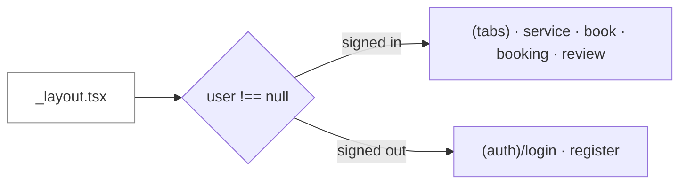

# AutoTransport — Mobile Client

Customer-facing app for a vehicle-shipping platform: browse transport options,
book a shipment, track it, and review it once delivered.

**Expo SDK 57 · React 19 · React Native 0.86 · expo-router · TanStack Query · zod**

> This directory is its own git repository. It talks to a Laravel API that lives
> in a sibling `backend/` directory of the parent monorepo — see
> [Connecting to the API](#connecting-to-the-api). The deeper design documents
> (`docs/architecture.md`, `docs/database-design.md`) are in that monorepo, not in
> this repository, so links to them only resolve in a full checkout.

---

## Quick start

```bash
npm install
npx expo start
```

Then press `w` for web, `a` for Android, `i` for iOS, or scan the QR code with
Expo Go.

The backend must be running or every screen shows a network error:

```bash
cd ../backend && php artisan migrate:fresh --seed && php artisan serve
```

**Demo login:** `customer@autotransport.test` / `password`

---

## Connecting to the API

The client reads `EXPO_PUBLIC_API_URL`, defaulting to
`http://localhost:8000/api/v1`.

`localhost` works for the web target and for an emulator on the same machine. **A
physical device cannot reach it** — `localhost` on a phone is the phone. Use your
machine's LAN address and bind the server to all interfaces:

```bash
EXPO_PUBLIC_API_URL=http://192.168.1.50:8000/api/v1 npx expo start
```

```bash
cd ../backend && php artisan serve --host=0.0.0.0
```

Only variables prefixed `EXPO_PUBLIC_` are exposed to client code, and they are
**inlined into the bundle at build time** — never put a secret in one.

---

## Route tree

Every file under `app/` is a route; `expo-router` is file-system based, so the
tree *is* the navigation graph. Parenthesised segments are groups — they organise
files without adding a URL segment, so `(tabs)/index.tsx` is `/`, not `/tabs`.

```
app/
├── _layout.tsx            providers + the auth guard
├── (auth)/
│   ├── login.tsx
│   └── register.tsx
├── (tabs)/
│   ├── index.tsx          Services  — browse and book
│   ├── bookings.tsx       Shipments — the review entry point
│   ├── contact.tsx        Contact form
│   └── account.tsx        Profile + sign out
├── service/[slug].tsx     detail, pricing, public reviews
├── book/[slug].tsx        the booking form
├── booking/[ulid].tsx     tracking timeline
├── review/[ulid].tsx      post-service review (modal)
└── +not-found.tsx
```

### The auth guard



`<Stack.Protected guard={…}>` swaps which group is reachable as the session
changes. **There is no imperative redirect**, so nothing races the first paint —
the older `useEffect` + `router.replace` pattern flashes the wrong screen for a
frame and is a known source of navigation loops.

Two consequences:

- **Sign-in and sign-out navigate nothing.** `signIn()` sets the user; the guard
  re-renders and the tab group becomes reachable on its own. A `router.push`
  after login is redundant and fights the guard.
- **The splash screen stays up until the stored token has been checked.** Hiding
  it earlier shows the login screen for a frame to someone who *is* signed in —
  brief, but it reads as being logged out, which is alarming in an app holding
  shipment records.

---

## Project layout

```
src/
├── api/
│   ├── client.ts        axios instance, token interceptor, 401 handling
│   └── endpoints.ts      route strings — the client half of the API contract
├── components/ui.tsx     the shared kit (Screen, Card, Button, Field, Stars…)
├── lib/
│   ├── booking.ts        status → label/tone helpers
│   └── storage.ts        token storage, with the web fallback
├── store/session.tsx     the signed-in user (React Context)
├── theme/
│   ├── tokens.ts         colour, spacing, radius, type
│   └── useTheme.ts       light/dark palette
└── types/
    ├── api.ts            response shapes + formatMoney()
    └── schemas.ts        zod validation mirroring the server rules
```

**Helpers live in `src/`, never in `app/`.** Everything under `app/` is a route;
importing a helper from one route file into another couples two screens through
the router's file map, and the helper disappears the day that screen is renamed.

### State: three layers, three owners

| Layer | Owner | Holds |
|---|---|---|
| Server state | TanStack Query | services, bookings, reviews |
| Session | React Context | the signed-in user |
| Form state | `useState` | local to one screen |

The session is Context rather than a module-level store because the
`Stack.Protected` guard has to re-render when auth changes — a value read outside
React would not trigger that.

Query defaults are `retry: 1`, `staleTime: 30s`, `refetchOnWindowFocus: false`. A
phone loses signal constantly: one silent retry absorbs a tunnel, more than that
just delays telling the user what went wrong.

---

## Verifying a change

```bash
npx tsc --noEmit                      # types, including generated route types
npx expo export --platform android    # proves it bundles
```

There is no test suite in this project yet. The backend carries 91 tests covering
the API this client consumes.

---

## Three things that will bite you

### 1. The stale route manifest

**`expo-router` builds its route manifest when the dev server starts.** A new file
under `app/` added to a running server is **not registered** — the browser keeps
serving a bundle with no knowledge of it and the screen is unreachable. Hot reload
updates *edited* files, which makes this especially confusing: your edits appear,
your new screen does not.

Restart with `npx expo start --clear`, then verify against the **served bundle**
rather than the file system:

```bash
curl -s "http://localhost:8081/node_modules/expo-router/entry.bundle?platform=web&dev=true" | grep -c "book/\[slug\]"
```

The same staleness affects `.expo/types/router.d.ts`, which is why `tsc` can
reject a valid `href` right after you add a screen.

### 2. `expo-secure-store` has no web build

The SDK 57 docs are explicit: *"Web is not supported."* An unguarded call throws
rather than degrading, and `app.json` configures a web bundler — so the web target
is real here.

`src/lib/storage.ts` splits it: Keychain on iOS, Keystore on Android,
`localStorage` on web. **The web fallback is genuinely weaker** — `localStorage` is
readable by any script that achieves XSS on the origin. Fine for a browser preview
of a mobile app. If the web build ever becomes a product surface, the fix is an
httpOnly cookie, not hardening that file: a token JavaScript can read is a token
XSS can steal wherever it is stashed.

Never `AsyncStorage` — plaintext on a rooted or jailbroken device.

### 3. The API contract is duplicated by hand

`src/api/endpoints.ts` mirrors the server's routes and `src/types/api.ts` mirrors
its response shapes, with **no mechanical link between them**. TypeScript will
happily type-check a string that no longer routes anywhere, so a renamed route is
a **silent 404 at runtime, not a compile error**.

```bash
cd ../backend && php artisan route:list --path=api
```

Diff that against `endpoints.ts` whenever either side changes.

Two conventions that come from the server side:

- **Money is integer minor units.** The API sends `{ cents: 19500, currency: "USD" }`.
  `formatMoney()` is the only thing that turns it into text — never divide in a
  template.
- **Identifiers are ULIDs.** `booking_ulid`, not `booking_id`. The integer id is
  never emitted by the API, so the client cannot hold one.

---

## Conventions worth keeping

**No raw hex values in screens.** Colour comes from `useTheme()`. That is what
makes dark mode a single lookup rather than an audit of every `StyleSheet`.
Spacing is a 4pt scale — arbitrary values are what make a layout look subtly wrong
in a way nobody can point at.

**`HIT_TARGET = 44`.** The Apple HIG floor, close enough to Android's 48dp that one
number serves both. Smaller targets fail people with motor impairments first and
everyone else in a moving vehicle second.

**Decorative glyphs are hidden from assistive tech.** Star rows and tab icons
carry `aria-hidden` / `importantForAccessibility="no"` with the real value on the
wrapper — otherwise a screen reader announces "star star star star star", which
conveys nothing.

**zod is for instant feedback, not safety.** The server re-validates everything.

---

## Declared but unused dependencies

`package.json` carries packages nothing imports — from the Expo template and from
planned scope:

| Package | Intended for |
|---|---|
| `zustand` | superseded — session state is React Context |
| `react-hook-form`, `@hookform/resolvers` | forms are `useState`; they are small |
| `react-native-maps` | tracking map on the booking screen |
| `expo-location` | driver location pings |
| `expo-notifications` | push on status change (`device_tokens` exists server-side) |
| `date-fns` | dates are ISO strings formatted by slicing |
| `expo-symbols` | superseded — tab icons are glyphs, no native dependency |

Listed rather than removed because several are next on the roadmap. **They are not
free** — each is resolved at install and some add native weight to a build. Prune
anything that stops being planned.

---

## Before writing code here

Read the **versioned** Expo docs: <https://docs.expo.dev/versions/v57.0.0/>.
Guidance written for older SDKs is actively wrong — SDK 56 removed support for
importing `@react-navigation/*` in application code, and auth guards moved to
`Stack.Protected`. See [`AGENTS.md`](AGENTS.md).
